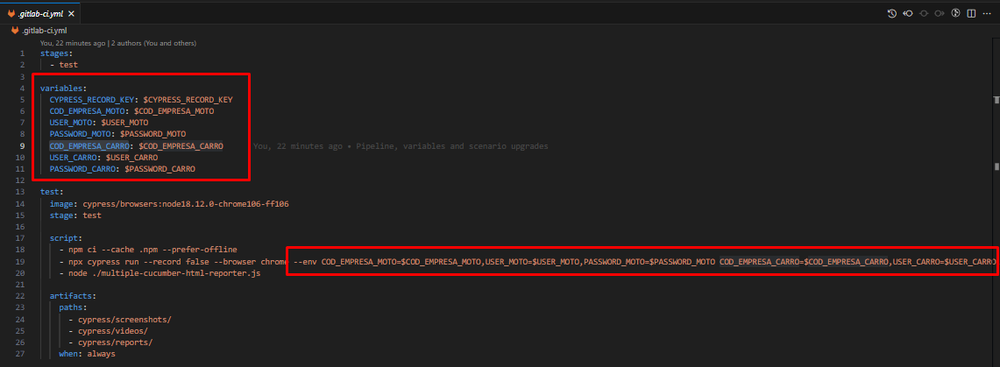

### Requisitos do Sistema

- [Node.js v14.90+](https://nodejs.org/en/download/current)

### Instalação

1. Clone o repositório via terminal

   ```sh
   git clone https://git.stefanini.io/ads/honda/banco/front/cnh_automacao_web.git
   ```
2. Instale as dependências e pacotes NPM

   ```sh
   npm install
   ```

### Variáveis de Ambiente

**Para Pipeline:**

Os dados de acesso ao ambiente estão anonimizados na pipeline.

Eles são informados no arquivo [`gitlab-ci.yml`](https://git.stefanini.io/ads/honda/banco/front/cnh_automacao_web/-/blob/main/.gitlab-ci.yml)

**Para Desenvolvimento:**\
Para execução dos dados para teste em ambiente de desenvolvimento, acesso o arquivo: `cypress.config.js` e modifique conforme sua necessidade na sessão env (mas não realize commit de suas credenciais):


### Execução via Browser

1. Execute o comando usando terminal na raíz do projeto

   ```sh
   npx cypress open
   ```
2. Após o carregamento, selecione a opção E2E Testing
3. Selecione o navegador desejado e clique em "Start E2E Testing browser"
4. Execute o teste .feature disponível

### Execução via CLI e geração de report na pasta reports>index.html

1. Execução de testes via CLI, gera JSON para report e exibe resultados (funciona em Headless Mode):

   ```sh
   npx cypress run
   ```
2. Atualiza report HTML na pasta reports>index.html

   ```sh
    node .\multiple-cucumber-html-reporter.js
   ```

   ## 🔴 Pré-requisitos

1. Node JS 14.19.0(ou superior)

## 🚀 Instale o projeto

1. Clone o repositório via terminal
   ```sh
   git clone https://example.com/xpto
3. Instale as dependências e pacotes NPM
   ```sh
   npm install
   ```
# honda-mobile-automation
 Mobile Automation with Appium and Codecept to Honda App

## Pré-requisitos

- NodeJS
- Java JDK
- Android Studio com SDK
```
npm i -g appium-doctor
npm i -g appium
appium driver install uiautomator2
npm install
```
- Instação de pacotes adicionais via SDKManager
- 
- Necessário configurações das seguintes variaveis no Windows
Exemplo de novas variaveis:
```
ANDROID_HOME C:\Users\<USER>\AppData\Local\Android\Sdk
JAVA_HOME C:\Program Files\Java\jdk-21\
```
Exemplo de como devem ser inseridas na variavel já existente PATH:
```
PATH: 
%ANDROID_HOME%\tools\bin 
%ANDROID_HOME%\platform-tools 
%ANDROID_HOME%\emulator
```

## Executando Testes
### Iniciar Appium
- Necessário --allow-cors para evitar problemas de comunicação entre a API e --base-path=/wd/hub pois é o caminho onde o CodeceptJS escuta
```
appium --allow-cors --base-path=/wd/hub
```
### Listar Emuladores
``` 
emulator -list-avds
```
### Listar Devices fisicos
``` 
adb devices -l
``` 
### Iniciar Emulador 
``` 
emulator -avd Pixel_3a_API_34_extension_level_7_x86_64
emulator -avd fullhd_pixel
```
### Rodar todos os testes e teste isolado
```
npx codeceptjs run 
npx codeceptjs run --steps tests/login_test.js
npx codeceptjs run --steps tests/insucesso_test.js
npx codeceptjs run --steps tests/ordemServiço_test.js
npx codeceptjs run --steps device_test.js

```

### Appium Inspector
Download Appium Inspector: https://github.com/appium/appium-inspector

Json de configuração do Appium Inspector para funcionamento minimo (Necessário ter os requisitos anteriores atendidos para utilização do inspector):
```
{"appium:deviceName": "Pixel_3a_API_34_extension_level_7_x86_64","platformName": "Android","appium:automationName": "UiAutomator2","appium:app": "C:\\mobyan-it\\mobyan-mobile-automation\\app\\app-hml-NOs-2.5.apk","autoGrantPermissions": "true"}
```


### Comandos para steps
- Executa script clickGesture do uiAutomator com coordenadas necessárias (método I.tap do Codecept com coordenadas não funciona)
```
  await I.executeScript('mobile: clickGesture', {
        x: 578,
        y: 993
    });
```
- Scroll com Elemento
```
I.tap(874, 1099)
    await I.executeScript('mobile: scrollGesture', {
        elementId: '//android.widget.ScrollView', // ID do elemento ScrollView
        direction: 'down', // Direção da rolagem
        percent: 0.75, // Porcentagem da área de rolagem a ser percorrida
        speed: 1000 // Velocidade da rolagem em pixels por segundo
    });
    await I.wait(2); // 
```

- Scroll down
```
    await I.executeScript('mobile: scrollGesture', {
        left: 0, // coordenada x do canto superior esquerdo da área de rolagem
        top: 400, // coordenada y do canto superior esquerdo da área de rolagem
        width: 600, // largura da área de rolagem
        height: 1000, // altura da área de rolagem
        direction: 'down', // direção da rolagem
        percent: 0.75, // porcentagem da área de rolagem a ser percorrida
        speed: 1000 // velocidade da rolagem em pixels por segundo
    });
    ```
```


    await I.executeScript('mobile: swipeGesture', {
        direction: 'down',
        percent: 1, // Rola a tela inteira
        left: 100, // Coordenada X inicial
        top: 100, // Coordenada Y inicial
        width: 200, // Largura da área de rolagem
        height: 200 // Altura da área de rolagem
    });
```

- Outras dicas:
```

// Long click gesture
await driver.executeScript('mobile: longClickGesture', {
    elementId: 'element_id',
    duration: 1000 // milliseconds
});

// Double click gesture
await driver.executeScript('mobile: doubleClickGesture', {
    elementId: 'element_id'
});

// Click gesture
await driver.executeScript('mobile: clickGesture', {
    elementId: 'element_id',
    x: 100,
    y: 100
});

// Drag gesture
await driver.executeScript('mobile: dragGesture', {
    elementId: 'element_id',
    startX: 100,
    startY: 100,
    endX: 200,
    endY: 200,
    speed: 1000 // pixels per second
});

// Fling gesture
await driver.executeScript('mobile: flingGesture', {
    elementId: 'element_id',
    direction: 'down',
    speed: 1000 // pixels per second
});

// Pinch open gesture
await driver.executeScript('mobile: pinchOpenGesture', {
    elementId: 'element_id',
    percent: 0.75
});

// Pinch close gesture
await driver.executeScript('mobile: pinchCloseGesture', {
    elementId: 'element_id',
    percent: 0.75
});

// Swipe gesture
await driver.executeScript('mobile: swipeGesture', {
    elementId: 'element_id',
    direction: 'down',
    percent: 0.75,
    speed: 1000 // pixels per second
});

// Scroll gesture
await driver.executeScript('mobile: scrollGesture', {
    elementId: 'element_id',
    direction: 'down',
    percent: 0.75,
    speed: 1000 // pixels per second
});
```

## 💻 Execute o projeto via terminal:

### Execução via Browser
1. Execute o comando usando terminal na raíz do projeto
   ```sh 
   npx cypress open
   ```
 2. Após o carregamento, selecione a opção E2E Testing


## 📖 Plugins desenolvidos para o projeto
### ExcelCommands
Consumo de dados predefinidos em série (consome dado e inválida dado que já foi utilizado)
### GenerateCPForCNPJ
Geração de CPF e CNPJ considerados válidos de acordo com os cálculos de verificação
### GenerateBankData
Geração de dados bancários considerados válidos pelas mascaras de validação


## 📖 Dependências

Integrado com:
- [x] Cucumber preprocessor https://www.npmjs.com/package/cypress-cucumber-preprocessor
- [x] Eslint https://www.npmjs.com/package/eslint
- [x] Faker.js https://github.com/faker-js/faker (geração de dados aleatórios)
- [x] Multiple Cucumber HTML reporter https://www.npmjs.com/package/multiple-cucumber-html-reporter
    
 ## ✍️ Autor
 #### Marcos Delano - mdfreitas@stefanini.com 
 Sinta-se a vontade para em contato no Teams ou e-mail para dúvidas, melhorias e sugestões. 

