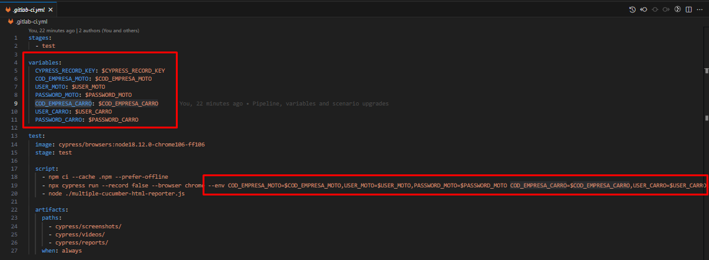
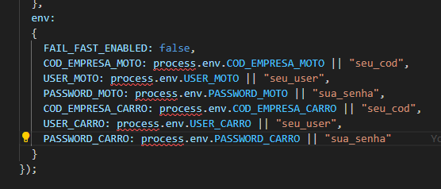

### Requisitos do Sistema

- [Node.js v14.90+](https://nodejs.org/en/download/current)

### Instalação

1. Clone o repositório via terminal

   ```sh
   git clone https://git.stefanini.io/ads/honda/banco/front/cnh_automacao_web.git
   ```
2. Instale as dependências e pacotes NPM

   ```sh
   npm install
   ```

### Variáveis de Ambiente

**Para Pipeline:**

Os dados de acesso ao ambiente estão anonimizados na pipeline.

Eles são informados no arquivo [`gitlab-ci.yml`](https://git.stefanini.io/ads/honda/banco/front/cnh_automacao_web/-/blob/main/.gitlab-ci.yml)

**Para Desenvolvimento:**\
Para execução dos dados para teste em ambiente de desenvolvimento, acesso o arquivo: `cypress.config.js` e modifique conforme sua necessidade na sessão env (mas não realize commit de suas credenciais):



### Execução via Browser

1. Execute o comando usando terminal na raíz do projeto

   ```sh
   npx cypress open
   ```
2. Após o carregamento, selecione a opção E2E Testing
3. Selecione o navegador desejado e clique em "Start E2E Testing browser"
4. Execute o teste .feature disponível

### Execução via CLI e geração de report na pasta reports>index.html

1. Execução de testes via CLI, gera JSON para report e exibe resultados (funciona em Headless Mode):

   ```sh
   npx cypress run
   ```
2. Atualiza report HTML na pasta reports>index.html

   ```sh
    node .\multiple-cucumber-html-reporter.js
   ```