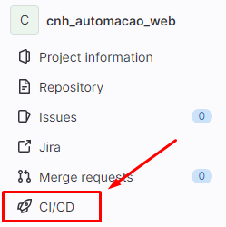
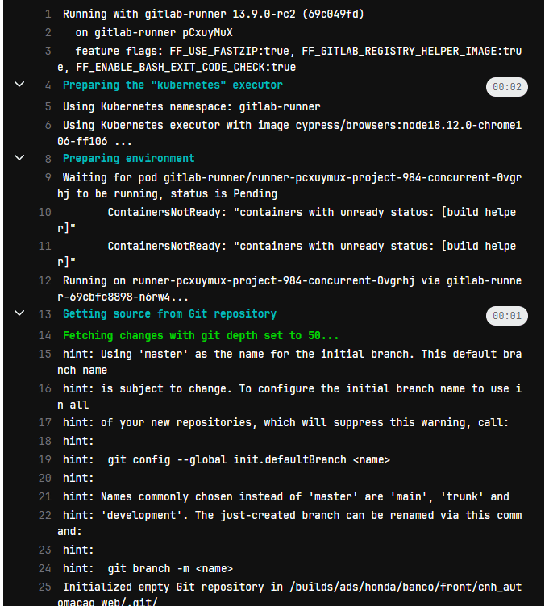

### Integração de Pipeline no Gitlab CI/CD

É configurada no arquivo `.gitlab-ci.yml` localizada na raíz do projeto e pode ser acompanhada aqui:

##### Estágios da Pipeline:

Teste: Este estágio é responsável pela execução dos testes automatizados de sua aplicação.

Variáveis da Pipeline:

CYPRESS_RECORD_KEY: Esta variável está cadastrada como secret, onde ela é responsável por fazer a integração com Cypress Cloud a cada execução de teste quando --record está inserido no script.

##### Configuração do Estágio de Teste:

Imagem: A imagem utilizada para este estágio é cypress/browsers:node18.12.0-chrome106-ff106. Esta imagem fornece um ambiente para executar seus testes no Cypress em uma versão específica do Node.js com os navegadores Chrome e Firefox.

Script: O script define as etapas a serem executadas durante o estágio de teste.

1. Instala dependências:

`npm ci --cache .npm --prefer-offline`

2. Executa cypress em CLI, gravando resultado no cypress cloud com --record e executando o chrome de acordo com a imagem docker selecionada:

`npx cypress run --record --browser chrome`

3. Executa multiple-cucumber-html-reporter.js onde após a execução é gerado relatórios através dos arquivos de reports/cucumber-json. Após geração, relatórios ficam disponíveis em cypress/reports/index.html. Artefatos: Os artefatos configurados incluem os diretórios cypress/screenshots/, cypress/videos/, cypress/reports/ e o arquivo cypress/reports/index.html.

`node ./multiple-cucumber-html-reporter.js`

Isso garantirá que os resultados dos testes, capturas de tela e vídeos estejam disponíveis como artefatos para referência posterior e análise detalhada na execução da pipeline continua no projeto, na opção CI/CD. Atualmente a automação está sendo executada a cada commit para main. Com essa pipeline, você terá uma configuração para executar os testes do Cypress, gravar os resultados e gerar relatórios detalhados para análise e acompanhamento.

