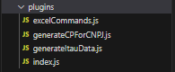

### Plugins de desenvolvimento próprio:

Os plugins ficam salvos em `cypress/plugins` e são declarados no arquivo `index.js.`



### GenerateCPForCNPJ:

Para gerar um CPF/CNPJ aleatório em padrão válido na automação basta seguir exemplo abaixo:

Utiliza somente Javascript.

#### CPF:

```
   cy.task('generateCPF').then(cpf => {
      cy.get(elem.ELEMENTS.CPFCNPJ).type(cpfValue);
    });
```

#### CNPJ:

```
   cy.task('generateCNPJ').then(cnpj => {
       cy.get(elem.ELEMENTS.CPFCNPJ).type(cnpjValue);
    });
```

### GenerateBankData:

Geração de dados bancários aleatórios em padrão válido.

Utiliza somente Javascript.

### excelCommandds:

Consumo de massa de dados em série via arquivo xlsx. Adaptável conforme necessidade dos cenários. 

Utiliza lib excelJs com Javascript.